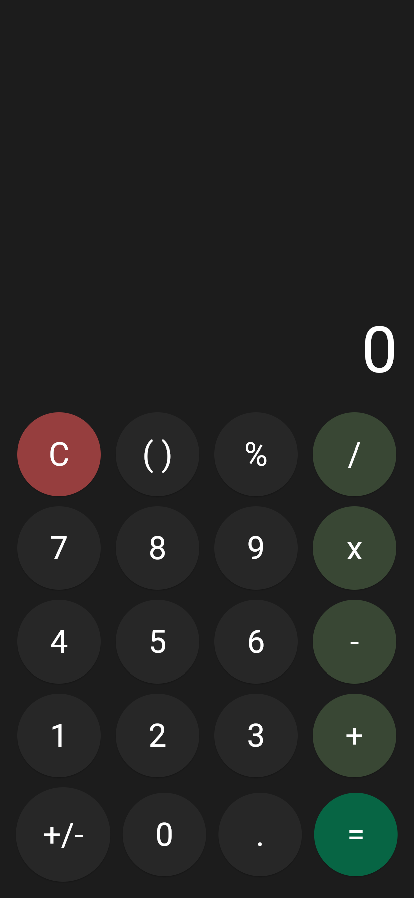
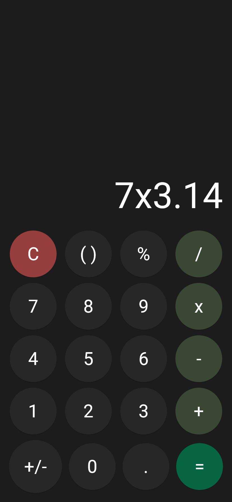
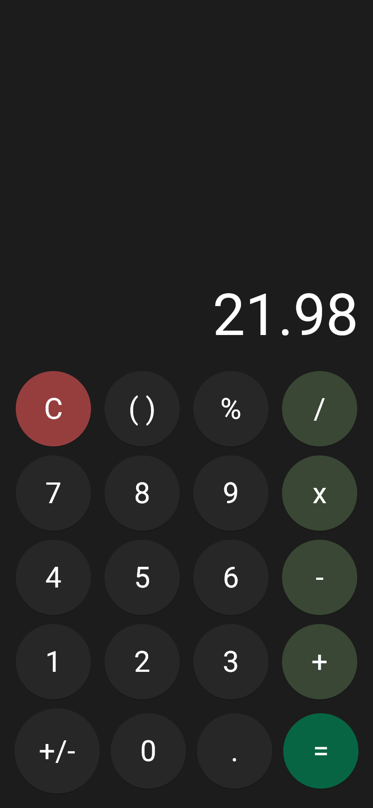

<<<<<<< HEAD
# Ứng Dụng Bỏ Túi Đơn Giản
[](https://opensource.org/licenses/MIT)

# Mô Tả Dự Án: 
Chào mừng bạn đến với ứng dụng bỏ túi đơn giản\!
Đây là sản phẩm của bài thực hành 1 môn Lập Trình Ứng Dụng Di Động Đa Nền Tảng của Cô Quỳnh Nga. Ứng dụng được triển khai bằng ngôn ngữ Dart cùng với framework Flutter mạnh mẽ, và thư mục dự án được cấu trúc logic dễ đọc hiểu. Đảm bảo mang để trải nghiệm mượt mà và trực quan trên nhiều thiết bị.

# Hình Ảnh Ứng Dụng

Dưới đây là một số hình ảnh về ứng dụng:

| Màn hình chính | Nhập phép tính | Kết quả |
| :---: | :---: | :---: |
|  |  |  |

===============================================
# Công Nghệ Sử Dụng
* **Ngôn Ngữ:** Dart
* **FrameWork:** Flutter

# Cài Đặt Và Sử Dụng
Để chạy ứng dụng trên máy của bạn, hãy làm theo các bước sau: 
1. **Clone Responsitory:**
    ```bash
    git clone [https://github.com/LeTien0811/flutter_calculator_LeVietTien.git]
    cd [flutter_calculator_LeVietTien]
2. **Chạy ứng dụng trên web:**
    ```bash
    flutter run -d web-server
    
>>>>>>> b96cfb4dbcc1442a7c9ff8c879eb7e449f8e3170
